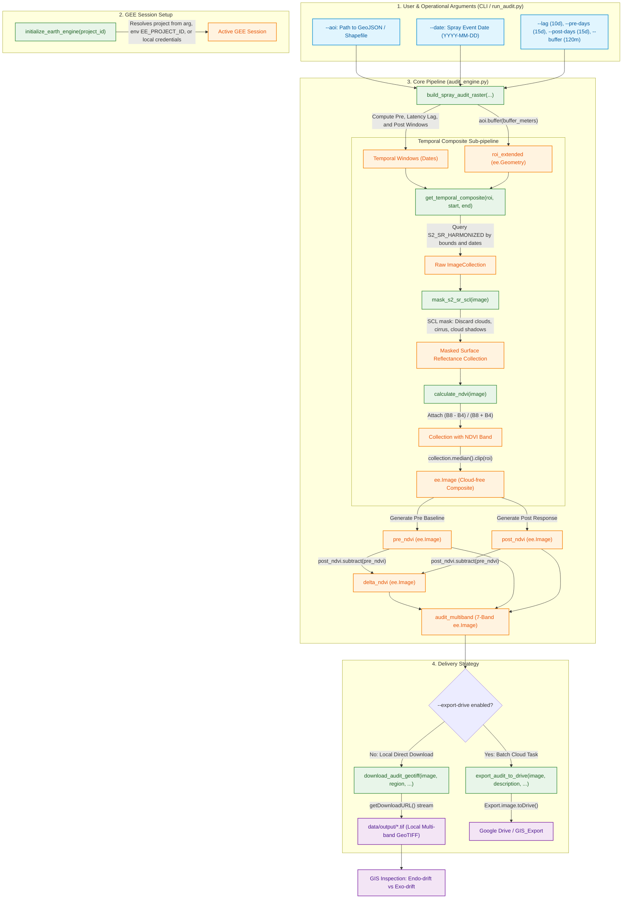

# Architecture & Data Flow Pipeline

This document details the software architecture, data lifecycle, function specifications, and execution flow of the **`spray-drift-detector`** engine.

---

## 1. System Pipeline Flow

The execution workflow is designed to ingest target agricultural parcels, dynamically define temporal baselines based on chemical mode of action (MoA), filter atmospheric contamination via Sentinel-2 Scene Classification Layer (SCL), and export multi-band spatial rasters ready for GIS inspection.

---

## 2. Technical Function Reference

### Module: `src/audit_engine.py`

#### `initialize_earth_engine(project_id: str | None = None) -> None`
- **Description:** Authenticates and starts an Earth Engine session dynamically.
- **Parameters:**
  - `project_id` (*str | None*): Target Google Cloud project. If not supplied, falls back to `EE_PROJECT_ID` environment variable or active local CLI credentials.

---

#### `mask_s2_sr_scl(image: ee.Image) -> ee.Image`
- **Description:** Performs pixel-level cloud, shadow, and cirrus masking using Sentinel-2 L2A Scene Classification Layer (SCL).
- **Parameters:**
  - `image` (*ee.Image*): Single Sentinel-2 Level-2A scene (`COPERNICUS/S2_SR_HARMONIZED`).
- **Internal Mechanism:**
  - Preserves valid land cover classes: `4` (Vegetation), `5` (Bare Soil), `6` (Water), `7` (Unclassified).
  - Eliminates invalid classes: `3` (Cloud Shadows), `8` (Medium Cloud Prob), `9` (High Cloud Prob), `10` (Cirrus).
  - Normalizes surface reflectance to $[0, 1]$ by scaling by $10000$.
- **Returns:** Scaled and masked `ee.Image`.

---

#### `calculate_ndvi(image: ee.Image) -> ee.Image`
- **Description:** Computes the Normalized Difference Vegetation Index.
- **Parameters:**
  - `image` (*ee.Image*): Multiband scene containing Band 8 (NIR) and Band 4 (Red).
- **Formula:** $\text{NDVI} = \frac{\text{B8} - \text{B4}}{\text{B8} + \text{B4}}$
- **Returns:** Single-band `ee.Image` named `'NDVI'`.

---

#### `get_temporal_composite(roi: ee.Geometry, start_date: str, end_date: str, max_cloud_percentage: float = 30.0) -> ee.Image`
- **Description:** Builds a cloud-free median mosaic over the extended parcel buffer across a given temporal window.
- **Parameters:**
  - `roi` (*ee.Geometry*): Extended parcel geometry (AOI + outer buffer).
  - `start_date` (*str*): Start of temporal window (`"YYYY-MM-DD"`).
  - `end_date` (*str*): End of temporal window (`"YYYY-MM-DD"`).
  - `max_cloud_percentage` (*float*): Cloud scene metadata threshold (default: `30.0`).
- **Mechanism:** Queries the collection, applies SCL masking, calculates NDVI, takes the pixel-wise **temporal median** (`.median()`), and clips to `roi`.
- **Returns:** Cloud-free `ee.Image`.

---

#### `build_spray_audit_raster(...) -> dict[str, Any]`
- **Description:** Main pipeline orchestrator that computes pre/post windows, evaluates vegetation response, and builds the multi-band audit raster.
- **Parameters:**
  - `aoi_geometry` (*ee.Geometry*): Field boundary polygon.
  - `application_date` (*str*): Spraying operation date (`"YYYY-MM-DD"`).
  - `pre_window_days` (*int*): Days prior to spray date to establish vigor baseline (default: `15`).
  - `lag_days` (*int*): Product latency / mode of action delay before post window opens (default: `10`).
  - `post_window_days` (*int*): Post-spray evaluation window duration (default: `15`).
  - `buffer_meters` (*float*): Distance in meters for the outward exo-drift buffer (default: `120.0`).
- **Returns:** `dict` containing:
  - `"audit_raster"`: 7-band `ee.Image` for export (`Delta_NDVI`, `NDVI_pre`, `NDVI_post`, `B4`, `B3`, `B2`, `B8`).
  - `"delta_ndvi"`: Single-band `ee.Image` ($\Delta\text{NDVI} = \text{NDVI}_{\text{post}} - \text{NDVI}_{\text{pre}}$).
  - `"roi_extended"`: `ee.Geometry` including the outward buffer.
  - `"windows"`: Computed dates dictionary.

---

#### `download_audit_geotiff(image: ee.Image, region: ee.Geometry, output_filepath: str, scale: int = 10, crs: str = 'EPSG:4326') -> str`
- **Description:** Direct stream download of field-scale GeoTIFFs using `ee.data.getDownloadURL` into the local file system.

---

#### `export_audit_to_drive(...) -> ee.batch.Task`
- **Description:** Submits an asynchronous batch export task to Google Drive for large regional footprints.

---

### Module: `run_audit.py` (CLI Interface)
- CLI entrypoint built with `argparse`.
- Parses `--aoi`, `--date`, `--lag`, `--buffer`, `--pre-days`, `--post-days`, and `--export-drive`.
- Automatically checks local AOI geometry, invokes `build_spray_audit_raster()`, and manages local GeoTIFF streaming or Google Drive task dispatch.
